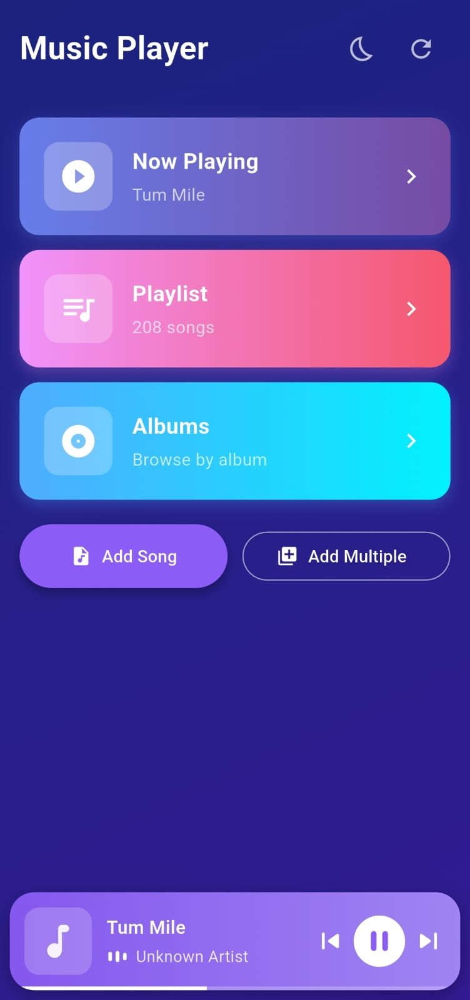

# 🎵 Harmony - Local Music Player

<div align="center">


**A beautiful, feature-rich local music player built with Flutter**

[Features](#-features) • [Screenshots](#-screenshots) • [Installation](#-installation) • [Architecture](#-architecture) • [Contributing](#-contributing)

</div>

---

## ✨ Features

### 🎼 Core Functionality
- **Smart File Selection** - Pick MP3 files from device storage with intuitive file picker
- **Advanced Audio Playback** - Powered by just_audio for high-quality, low-latency playback
- **Metadata Extraction** - Automatically extracts title, artist, album, and embedded album art
- **Interactive Seek Bar** - Real-time progress tracking with drag-to-seek functionality
- **Playback Controls** - Play, pause, skip previous/next with smooth animations

### 🎨 User Interface
- **Modern Design** - Clean, minimalist interface with stunning gradient backgrounds
- **Responsive Layout** - Optimized for all screen sizes and orientations
- **Smooth Animations** - Fluid transitions and micro-interactions
- **Album Art Display** - Beautiful artwork presentation with fallback designs
- **Dark Theme** - Eye-friendly dark mode optimized for music listening

### 🔧 Technical Features
- **Provider State Management** - Efficient, scalable state management architecture
- **Error Handling** - Comprehensive error catching with user-friendly messages
- **Memory Efficient** - Optimized for low memory footprint
- **Clean Architecture** - Well-structured, maintainable codebase
- **Type Safety** - Full Dart null-safety implementation

---

## 📱 Screenshots

<div align="center">

|  |
|  |
|  |
|  |
|  |

</div>

---

## 🚀 Installation

### Prerequisites
- Flutter SDK (3.0 or higher)
- Dart SDK (3.0 or higher)
- Android Studio / Xcode (for respective platforms)
- A physical device or emulator

### Setup Instructions

1. **Clone the repository**
   ```bash
   git clone https://github.com/yourusername/harmony-music-player.git
   cd harmony-music-player
   ```

2. **Install dependencies**
   ```bash
   flutter pub get
   ```

3. **Run the app**
   ```bash
   flutter run
   ```

### Platform-Specific Setup

#### Android
- Minimum SDK: 21 (Android 5.0)
- Target SDK: 34 (Android 14)
- Permissions handled automatically

#### iOS
- Minimum iOS version: 12.0
- Add the following to your `Info.plist`:
  ```xml
  <key>NSAppleMusicUsageDescription</key>
  <string>This app needs access to your music library</string>
  ```

---

## 📦 Dependencies

| Package | Version | Purpose |
|---------|---------|---------|
| [just_audio](https://pub.dev/packages/just_audio) | ^0.9.36 | High-performance audio playback |
| [file_picker](https://pub.dev/packages/file_picker) | ^6.1.1 | Native file selection dialog |
| [audiotagger](https://pub.dev/packages/audiotagger) | ^2.2.1 | ID3 tag and metadata extraction |
| [provider](https://pub.dev/packages/provider) | ^6.1.1 | State management solution |
| [flutter_svg](https://pub.dev/packages/flutter_svg) | ^2.0.9 | SVG rendering support |

---

## 🏗️ Architecture

### Project Structure
```
lib/
├── main.dart                      # App entry point
├── providers/
│   └── audio_player_provider.dart # Audio state management
├── screens/
│   ├── home_screen.dart          # Main screen
│   └── player_screen.dart        # Now playing screen
├── widgets/
│   ├── album_art_widget.dart     # Album artwork display
│   ├── player_controls.dart      # Playback buttons
│   └── seek_bar_widget.dart      # Progress bar
└── models/
    └── track_model.dart          # Audio track data model
```

### Design Patterns
- **Provider Pattern** - For reactive state management
- **Widget Composition** - Reusable, modular UI components
- **Separation of Concerns** - Clear distinction between UI, logic, and data

### State Management Flow
```
User Action → Provider (Business Logic) → UI Update
     ↓                    ↓                    ↓
File Picker    →   Audio Processing   →   Display Update
Playback       →   State Management   →   Animation
Seek           →   Position Update    →   Progress Bar
```

---

## 🎯 Roadmap

### v1.1 (Coming Soon)
- [ ] Playlist management
- [ ] Queue functionality
- [ ] Shuffle and repeat modes
- [ ] Audio equalizer
- [ ] Sleep timer

### v1.2 (Future)
- [ ] Background playback
- [ ] Lock screen controls
- [ ] Lyrics display
- [ ] Multiple audio format support (FLAC, AAC, OGG)
- [ ] Folder-based library organization

### v2.0 (Long-term)
- [ ] Music library scanning
- [ ] Artist/Album views
- [ ] Search functionality
- [ ] Favorites and recently played
- [ ] Theme customization
- [ ] Cross-device sync

---

## 🐛 Known Issues & Limitations

### Current Limitations
- **File Format**: Only MP3 files are currently supported
- **Playback Mode**: Single track playback (no automatic next track)
- **Background**: No background playback service
- **Library**: No automatic music library scanning
- **Storage**: Files must be manually selected each time

### Workarounds
- For multiple tracks, manually select next file after current finishes
- Keep app in foreground for continuous playback
- Use files with embedded metadata for best experience

---

## 🤝 Contributing

We welcome contributions! Here's how you can help:

### Ways to Contribute
1. 🐛 **Report bugs** - Open an issue with detailed reproduction steps
2. 💡 **Suggest features** - Share your ideas in the discussions
3. 📝 **Improve documentation** - Help make our docs better
4. 💻 **Submit PRs** - Fix bugs or implement new features

### Development Setup
```bash
# Fork the repository
# Clone your fork
git clone https://github.com/Aniudupa15/Music-Player_BOSE.git

# Enter the folder
cd Music-Player_BOSE

# Run the flutter app 
flutter run

# Open a Pull Request
```

### Code Standards
- Follow [Effective Dart](https://dart.dev/guides/language/effective-dart) guidelines
- Add comments for complex logic
- Write unit tests for new features
- Ensure `flutter analyze` passes
- Format code with `flutter format`

## 👨‍💻 Author

**Your Name**
- GitHub: [@Aniudupa15](https://github.com/Aniudupa15)
- Email: aniudupa15@gmail.com
- LinkedIn: [Anirudha ](https://www.linkedin.com/in/anirudha-udupa-815b0b258/)

---

## 🙏 Acknowledgments

- [just_audio](https://pub.dev/packages/just_audio) by [Ryanheise](https://github.com/ryanheise) for excellent audio capabilities
- Flutter team for the amazing framework
- The open-source community for inspiration and support
- [Unsplash](https://unsplash.com) for beautiful placeholder images

---

## 📊 Project Stats


---

<div align="center">

**If you find this project useful, please consider giving it a ⭐!**

Made with ❤️ and Flutter

</div>